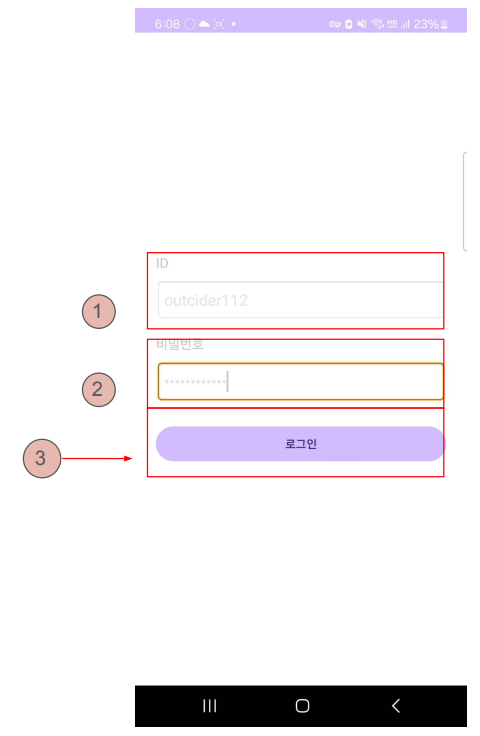
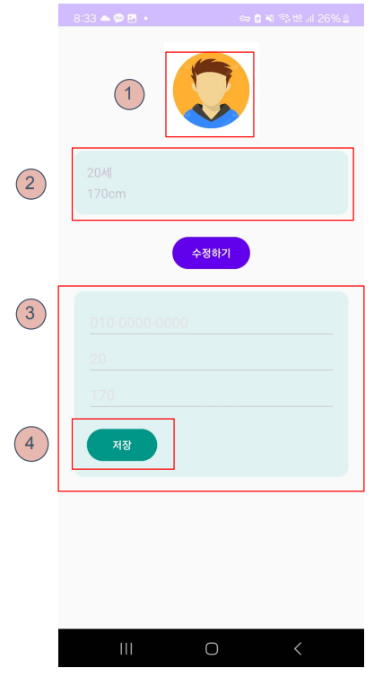
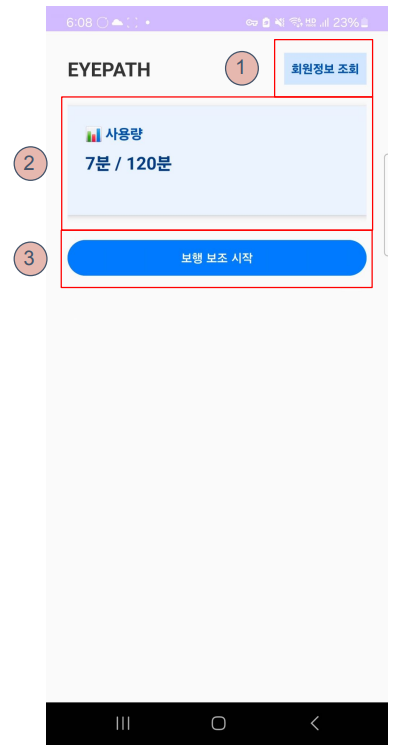
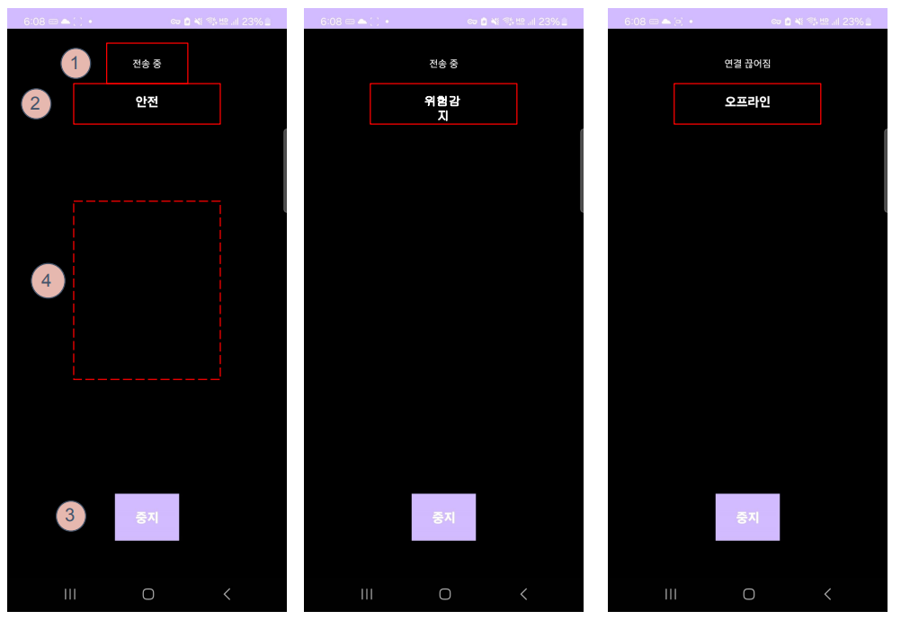

# 👁️ EYEPATH - Smart Mobility Assistant App

> Embedded System Project, Department of Mobile System Engineering, Dankook University  
> Team: Kim Woosung, Lee Youngjoo, Lim Seokbeom  
> GitHub: [github.com/EYEPATH-EMBEDDED](https://github.com/EYEPATH-EMBEDDED)

---

## 📱 Introduction

EYEPATH is an Android application designed to assist visually impaired users by providing **real-time collision alerts**.  
Using CameraX, the app streams live video to an AI server that detects risks and responds with **vibration, notifications, and audio warnings**.

---

## 🧩 Core Features

### 1. 🔐 Login & Authentication
- JWT-based login
- AccessToken stored securely in `SharedPreferences` upon success



**① ID Input Box**  
**② Password Input Box**  
**③ Login Button**

---

### 2. 👤 Profile Information
- View and edit user information such as phone number, age, height
- Changes are sent via PUT requests to the server



**① Profile Image**  
**② Display of Current Info (age, height)**  
**③ Input fields for phone, age, height**  
**④ Save Button**

---

### 3. 📊 Dashboard
- Displays the current month's usage time
- Provides access to start the assistive service



**① View Profile Button**  
**② Usage Summary Component**  
**③ Start Assistive Service Button**

---

### 4. 📷 Real-time AI Prediction
- Streams camera frames using `CameraX + ImageAnalysis`
- Frames are compressed to JPEG and sent as Base64 via WebSocket
- AI responds with predictions within 500ms for immediate feedback



---

## 🔌 Server & API Integration

| Function         | Protocol     | Endpoint                                               |
|------------------|--------------|--------------------------------------------------------|
| Login            | REST (POST)  | `http://10.0.20.166:8080/auth/login`                  |
| User Info        | REST (GET/PUT)| `http://10.0.20.166:8080/users`                        |
| Usage Info       | REST (GET)   | `http://10.0.20.167:8080/usage/{userId}`              |
| Collision Alert  | WebSocket    | `ws://10.0.20.161:8000/ws/collision?token=...`        |

---

## ⚙️ Tech Stack

- **Android (Kotlin/Java)**
- **Jetpack CameraX**
- **OkHttp** (REST + WebSocket)
- **Gradle 8.11.1**
- **Android SDK 35 (minSdk 24)**

---

## 🗃️ Project Structure

```
EYEPATH_APP/
├── app/
│   ├── src/main/java/dku/mse/eyepath/
│   │   ├── LoginActivity.java
│   │   ├── DashboardActivity.java
│   │   ├── WebsocketAIActivity.java
│   │   ├── ProfileActivity.java
│   ├── res/
│   │   ├── layout/ (UI XML)
│   │   ├── drawable/ (icons/styles)
│   │   ├── values/ (styles, colors)
├── build.gradle.kts
├── settings.gradle.kts
├── gradle.properties
```

---

## ✅ App Flow

1. User logs in and lands on Dashboard
2. User starts the assistive session
3. Frames are streamed → analyzed by AI → returns result
4. In case of risk, feedback via vibration/sound/message

---

## 🛠️ How to Run

```bash
git clone https://github.com/EYEPATH-EMBEDDED/EYEPATH_APP.git
cd EYEPATH_APP
./gradlew assembleDebug
```

Recommended: Run with Android Studio on device.

---

## 🙌 Contributors

- Kim Woosung  
- Lee Youngjoo  
- Lim Seokbeom  
(Dankook University, Mobile System Engineering)
